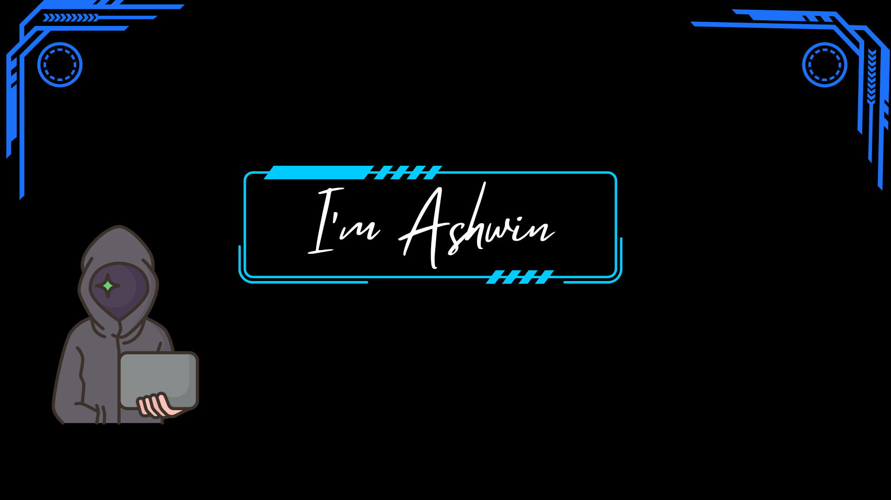

# Ashwinhacker.io

<html>
    <head>
        <title> Ashwin </title>
    </head>
    <body>
        
    </body>
    <h1>About me</h1>
    

        

          
          <h2>Hello.</h2>
          
Hello, I'm Ashwin Kumar, a passionate cybersecurity enthusiast with a focus on hardware hacking, bug bounties, and Capture The Flag (CTF) challenges.
             I recently completed the Certified Ethical Hacker (CEH) v12 certification. I lead the Cyber AXD community, where we explore and share knowledge on various cybersecurity topics.
            I'm also excited to announce that my upcoming course will be available on Udemy.addicted to Technology . 

        

        

            <h2>My Skills.</h2>
            

                     Bug bounty,CTF,Tool developer,coder,Editor</h3>
              
    
            

    
            

              

                
                      <h4>Python:⭐⭐⭐⭐⭐  </h4>
                      <h4>C     :⭐⭐</h4>
                      <h4>HTML   :⭐⭐⭐</h4>
                      <h4>js  :⭐⭐⭐</h4>
                      <h4>bash : ⭐⭐⭐ </h4>
                   <h4>   Kali linux:⭐⭐⭐⭐⭐ </h4>
                   <h4>   Hardware hacking ⭐⭐</h4>

                   

                

                

                

                  <h2>Get In Touch</h2>
                  <h3>If you like my profile join cyber AxD ,We can grow together</h3>
                  <a class="btn" href="ashwinop58@gmail.com">CONTACT ME</a>
                

              

          
          
              

                <a class="footer-link" href="https://linkedin.com/in/ashwin-kumar-66784926a">LinkedIn</a>
                
----------------

                <a class="footer-link" href="https://www.instagram.com/ashwin_074/">Instagram</a>
                
----------------

                <a class="footer-link" href="https://medium.com/@ashwin74/wifi-hacking-38c0d991716d">Medium</a>
                
----------------

                <a class="footer-link" href="https://www.youtube.com/@CyberAxD">Youtube</a>
              

          
          

</html>
